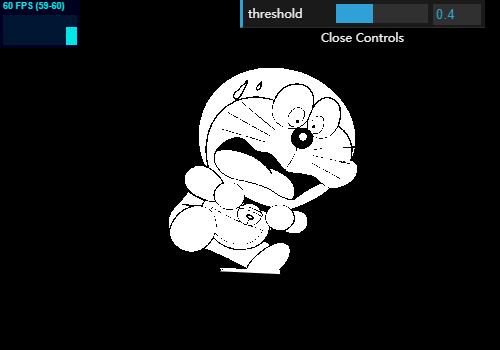

## three.js常用的滤镜着色器

在Three.js中使用着色器时，片段着色器所需的最小计算如下：
```glsl
varying vec2 vUv;
uniform sampler2D tDiffuse;
void main() {
  vec4 color = texture2D(tDiffuse, vUv);
  gl_FragColor = color;
}
```

------------

### 灰色效果
着色器将显示更改为单色（黑白）。通过计算红色，绿色和蓝色的三原色并消除饱和度，则为灰色。
首先，从每种RGB颜色计算亮度。(r + g + b) / 3.0 得到亮度值，将其乘以黑白。
```glsl
#define R_LUMINANCE 0.298912
#define G_LUMINANCE 0.586611
#define B_LUMINANCE 0.114478
 
varying vec2 vUv;
uniform sampler2D tDiffuse;
const vec3 monochromeScale = vec3(R_LUMINANCE, G_LUMINANCE, B_LUMINANCE);
 
void main() {
  vec4 color = texture2D(tDiffuse, vUv);
  float grayColor = dot(color.rgb, monochromeScale);
  color = vec4(vec3(grayColor), 1.0);
  gl_FragColor = vec4(color);
}
```
[demo](https://hafly.github.io/three.js-filter/examples/gray.html)


------------

### 反色效果
正如其名称所示，通过反转颜色的数值达到效果。
具体来说，像素颜色值将为“0.0到1.0”，因此您只需通过从1.0中减去颜色值即可简单地反转颜色。
顺便说一下，颜色值是“x”是红色，“y”是蓝色，“z”是绿色。
```glsl
varying vec2 vUv;
uniform sampler2D tDiffuse;
 
void main() {
  vec4 color = texture2D(tDiffuse, vUv);
  gl_FragColor = vec4(1.0 - color.x, 1.0 - color.y, 1.0 - color.z, 1.0);
}
```

[demo](https://hafly.github.io/three.js-filter/examples/invert.html)


------------

### 复古效果
这个着色器会将显示更改为棕褐色调，类似经常在电影回忆场景中看到的效果。
```glsl
#define R_LUMINANCE 0.298912
#define G_LUMINANCE 0.586611
#define B_LUMINANCE 0.114478
 
varying vec2 vUv;
uniform sampler2D tDiffuse;
 
void main() {
  vec4 color = texture2D(tDiffuse, vUv);
  float v = color.x * R_LUMINANCE + color.y * G_LUMINANCE + color.z * B_LUMINANCE;
  color.x = v * 0.9;
  color.y = v * 0.7;
  color.z = v * 0.4;
  gl_FragColor = vec4(color);
}
```

[demo](https://hafly.github.io/three.js-filter/examples/vintage.html)


------------

### 阈值效果
仅用黑白表示图像颜色，此顶点亮度大于0.533333，将其填充为白色，否则将其填充为黑色。
```glsl
#define R_LUMINANCE 0.298912
#define G_LUMINANCE 0.586611
#define B_LUMINANCE 0.114478

varying vec2 vUv;
uniform sampler2D tDiffuse;

void main() {
  vec4 color = texture2D(tDiffuse, vUv);
  float v = color.x * R_LUMINANCE + color.y * G_LUMINANCE + color.z * B_LUMINANCE;
  if (v >= 0.53333) {
    v = 1.0;
  } else {
    v = 0.0;
  }
  gl_FragColor = vec4(vec3(v, v, v), 1.0);
}
```

[demo](https://hafly.github.io/three.js-filter/examples/threshold.html)


------------

### 浮雕效果
获取一个角度的两个texture进行相减，再进行灰度化。
```glsl
  varying vec2 vUv;
  uniform sampler2D tDiffuse;
  uniform float fScale;
  const highp vec3 W = vec3(0.2125, 0.7154, 0.0721);
  vec2 TexSize = vec2(fScale, fScale);
  const vec4 bkColor = vec4(0.5, 0.5, 0.5, 1.0);

  void main() {
    vec2 upLeftUV = vec2(vUv.x-1.0/TexSize.x, vUv.y-1.0/TexSize.y);
    vec4 curColor = texture2D(tDiffuse, vUv);
    vec4 upLeftColor = texture2D(tDiffuse, upLeftUV);
    vec4 delColor = curColor - upLeftColor;
    float luminance = dot(delColor.rgb, W);
    gl_FragColor = vec4(vec3(luminance), 0.0) + bkColor;
  }
```

[demo](https://hafly.github.io/three.js-filter/examples/relief.html)


------------

### 高斯模糊效果
该算法实际上来说就是对图像进行卷积计算。在计算每一个片元的颜色时，将其左边四个点和右边四个点的颜色进行一定比例的加和（横向高斯模糊），再对其上面四个点和下面四个点的颜色按照一定比例进行加和（纵向高斯模糊）最终得到模糊的画面，这里值得注意的是我们在进行高斯模糊时最后所乘的系数和一定要控制在1，不然就会出现图片过亮的状态。
```glsl
  varying vec2 vUv;
  uniform sampler2D tDiffuse;
  uniform vec2 vScreenSize;
  uniform float fScale;

  void main() {
    vec4 sum = vec4(0.0);
    float h = fScale/vScreenSize.x;
    float v = fScale/vScreenSize.y;

    //纵向高斯模糊
    sum += texture2D(tDiffuse, vec2(vUv.x, vUv.y - 4.0 * v)) * (0.051/2.0);
    sum += texture2D(tDiffuse, vec2(vUv.x, vUv.y - 3.0 * v)) * (0.0918/2.0);
    sum += texture2D(tDiffuse, vec2(vUv.x, vUv.y - 2.0 * v)) * (0.12245/2.0);
    sum += texture2D(tDiffuse, vec2(vUv.x, vUv.y - 1.0 * v)) * (0.1531/2.0);
    sum += texture2D(tDiffuse, vec2(vUv.x, vUv.y)) * (0.1633/2.0);
    sum += texture2D(tDiffuse, vec2(vUv.x, vUv.y + 1.0 * v)) * (0.1531/2.0);
    sum += texture2D(tDiffuse, vec2(vUv.x, vUv.y + 2.0 * v)) * (0.12245/2.0);
    sum += texture2D(tDiffuse, vec2(vUv.x, vUv.y + 3.0 * v)) * (0.0918/2.0);
    sum += texture2D(tDiffuse, vec2(vUv.x, vUv.y + 4.0 * v)) * (0.051/2.0);

    //横向高斯模糊
    sum += texture2D(tDiffuse, vec2(vUv.x - 4.0 * h, vUv.y)) * (0.051/2.0);
    sum += texture2D(tDiffuse, vec2(vUv.x - 3.0 * h, vUv.y)) * (0.0918/2.0);
    sum += texture2D(tDiffuse, vec2(vUv.x - 2.0 * h, vUv.y)) * (0.12245/2.0);
    sum += texture2D(tDiffuse, vec2(vUv.x - 1.0 * h, vUv.y)) * (0.1531/2.0);
    sum += texture2D(tDiffuse, vec2(vUv.x, vUv.y)) * (0.1633/2.0);
    sum += texture2D(tDiffuse, vec2(vUv.x + 1.0 * h, vUv.y)) * (0.1531/2.0);
    sum += texture2D(tDiffuse, vec2(vUv.x + 2.0 * h, vUv.y)) * (0.12245/2.0);
    sum += texture2D(tDiffuse, vec2(vUv.x + 3.0 * h, vUv.y)) * (0.0918/2.0);
    sum += texture2D(tDiffuse, vec2(vUv.x + 4.0 * h, vUv.y)) * (0.051/2.0);

    gl_FragColor = sum;
  }
```

[demo](https://hafly.github.io/three.js-filter/examples/gaussianblur.html)


------------

### 磨砂玻璃效果
思路是从相邻像素中随机获取像素：
```glsl
varying vec2 vUv;
uniform sampler2D tDiffuse;
uniform vec2 vScreenSize;

float rand(vec2 co) {
  float a = fract(dot(co, vec2(2.067390879775102, 12.451168662908249))) - 0.5;
  float s = a * (6.182785114200511 + a * a * (-38.026512460676566 + a * a * 53.392573080032137));
  float t = fract(s * 43758.5453);
  return t;
}

void main() {
  float radius = 5.0;
  float x = (vUv.x * vScreenSize.x) + rand(vUv) * radius * 2.0 - radius;
  float y = (vUv.y * vScreenSize.y) + rand(vec2(vUv.y, vUv.x)) * radius * 2.0 - radius;
  vec4 textureColor = texture2D(tDiffuse, vec2(x, y) / vScreenSize);
  gl_FragColor = textureColor;
}
```
[demo](https://hafly.github.io/three.js-filter/examples/groundglass.html)


------------

### 马赛克效果
– 通过任意像素水平和垂直分割当前屏幕
– 通过查看分割中的中心像素来设置像素颜色
– 最初，最好在分割像素内设置平均值
以下代码fMosaicScale是着色器外部的镶嵌设置的像素数。
```glsl
varying vec2 vUv;
uniform sampler2D tDiffuse;
uniform vec2 vScreenSize;
uniform float fMosaicScale;
void main() {
  vec2 vUv2 = vUv;
  vUv2.x = floor(vUv2.x * vScreenSize.x / fMosaicScale) / (vScreenSize.x / fMosaicScale) + (fMosaicScale / 2.0) / vScreenSize.x;
  vUv2.y = floor(vUv2.y * vScreenSize.y / fMosaicScale) / (vScreenSize.y / fMosaicScale) + (fMosaicScale / 2.0) / vScreenSize.y;
 
  vec4 color = texture2D(tDiffuse, vUv2);
  gl_FragColor = color;
}
```

[demo](https://hafly.github.io/three.js-filter/examples/mosaic.html)


------------

### 随机抖动效果
随机抖动是阈值的改进。它也用白色和黑色表示，但如果要比阈值看似均匀一些。它并不是直接将一点填充为白/黑，而是在某个范围内随机混合白/黑。
顺便说一下，GLSL没有随机功能，所以我们需要自己实现它。
```glsl
#define R_LUMINANCE 0.298912
#define G_LUMINANCE 0.586611
#define B_LUMINANCE 0.114478

varying vec2 vUv;
uniform sampler2D tDiffuse;

float rand(vec2 co) {
  float a = fract(dot(co, vec2(2.067390879775102, 12.451168662908249))) - 0.5;
  float s = a * (6.182785114200511 + a * a * (-38.026512460676566 + a * a * 53.392573080032137));
  float t = fract(s * 43758.5453);
  return t;
}

void main() {
  vec4 color = texture2D(tDiffuse, vUv);
  float v = color.x * R_LUMINANCE + color.y * G_LUMINANCE + color.z * B_LUMINANCE;
  if (v > rand(vUv)) {
    color.x = 1.0;
    color.y = 1.0;
    color.z = 1.0;
  } else {
    color.x = 0.0;
    color.y = 0.0;
    color.z = 0.0;
  }
  gl_FragColor = color;
}
```

[demo](https://hafly.github.io/three.js-filter/examples/randomshake.html)


------------

### 拜耳抖动效果
拜耳抖动比上面的阈值化更清晰地显示阴影。
我们将使用4像素×4像素的阈值表来确定每个像素的颜色。将当前像素的亮度与阈值表进行比较，亮度高为白色较小则变为黑色。此外，由于需要获取像素位置，例如每4个像素而不是UV位置，我们将着色器外部的屏幕尺寸设置为vScreenSize。
```glsl
#define R_LUMINANCE 0.298912
#define G_LUMINANCE 0.586611
#define B_LUMINANCE 0.114478

varying vec2 vUv;
uniform sampler2D tDiffuse;
uniform vec2 vScreenSize;

void main() {
  vec4 color = texture2D(tDiffuse, vUv);
  float x = floor(vUv.x * vScreenSize.x);
  float y = floor(vUv.y * vScreenSize.y);
  mat4 m = mat4(
    vec4( 0.0,  8.0,  2.0,  10.0),
    vec4( 12.0, 4.0,  14.0, 6.0),
    vec4( 3.0,  11.0, 1.0,  9.0),
    vec4( 15.0, 7.0,  13.0, 5.0)
  );
  float xi = mod(x, 4.0);
  float yi = mod(y, 4.0);
  float threshold = 0.0;

  if(xi == 0.0) { 
    if(yi == 0.0) {threshold = m[0][0]; }
    if(yi == 1.0) {threshold = m[0][1]; }
    if(yi == 2.0) {threshold = m[0][2]; }
    if(yi == 3.0) {threshold = m[0][3]; }
  }

  if(xi == 1.0) {
    if(yi == 0.0) {threshold = m[1][0]; }
    if(yi == 1.0) {threshold = m[1][1]; }
    if(yi == 2.0) {threshold = m[1][2]; }
    if(yi == 3.0) {threshold = m[1][3]; }
  }

  if(xi == 2.0) {
    if(yi == 0.0) {threshold = m[2][0]; }
    if(yi == 1.0) {threshold = m[2][1]; }
    if(yi == 2.0) {threshold = m[2][2]; }
    if(yi == 3.0) {threshold = m[2][3]; }
  }

  if(xi == 3.0) {
    if(yi == 0.0) {threshold = m[3][0]; }
    if(yi == 1.0) {threshold = m[3][1]; }
    if(yi == 2.0) {threshold = m[3][2]; }
    if(yi == 3.0) {threshold = m[3][3]; }
  }
  color = color * 16.0;

  float v = color.x * R_LUMINANCE + color.y * G_LUMINANCE + color.z * B_LUMINANCE;
  if (v < threshold) {
    color.x = 0.0;
    color.y = 0.0;
    color.z = 0.0;
  } else {
    color.x = 1.0;
    color.y = 1.0;
    color.z = 1.0;
  }

  gl_FragColor = color;
}
```

[demo](https://hafly.github.io/three.js-filter/examples/bayershake.html)


------------

### 旋涡效果
使用三角函数可以很容易地实现螺旋，参考涡旋的中心位置将像素颜色设置在一点一点地进行旋转的位置处，离中心越远位移越大。
```glsl
uniform sampler2D tDiffuse;
varying vec2 vUv;
uniform vec2 vScreenSize;
uniform vec2 vCenter;
uniform float fRadius;
uniform float fUzuStrength;

void main() {
  vec2 pos = (vUv * vScreenSize) - vCenter;
  float len = length(pos);
  if(len >= fRadius) {
    gl_FragColor = texture2D(tDiffuse, vUv);
    return;
  }

  float uzu = min(max(1.0 - (len / fRadius), 0.0), 1.0) * fUzuStrength;
  float x = pos.x * cos(uzu) - pos.y * sin(uzu);
  float y = pos.x * sin(uzu) + pos.y * cos(uzu);
  vec2 retPos = (vec2(x, y) + vCenter) / vScreenSize;
  vec4 color = texture2D(tDiffuse, retPos);
  gl_FragColor = color;
}
```

[demo](https://hafly.github.io/three.js-filter/examples/vortex.html)
